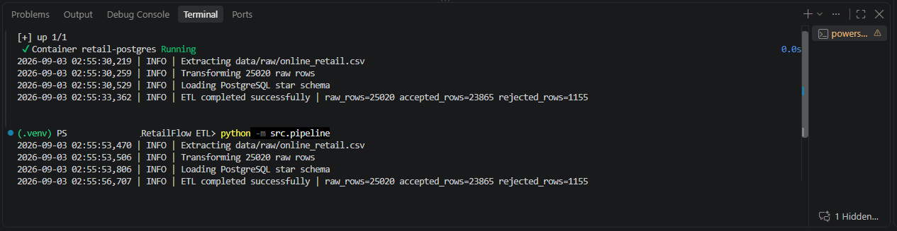
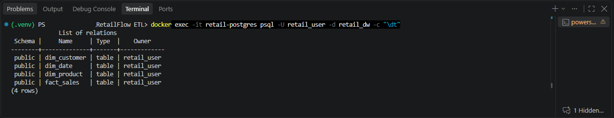
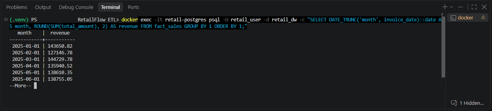
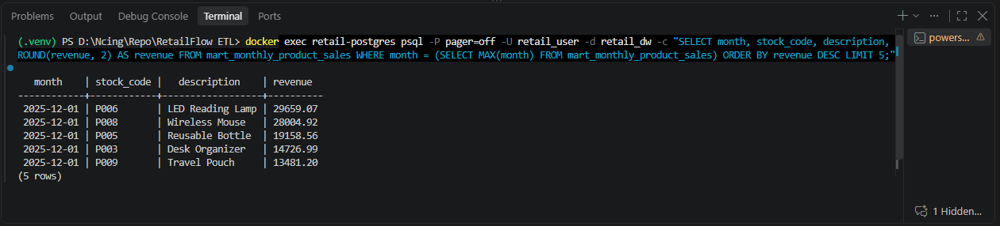
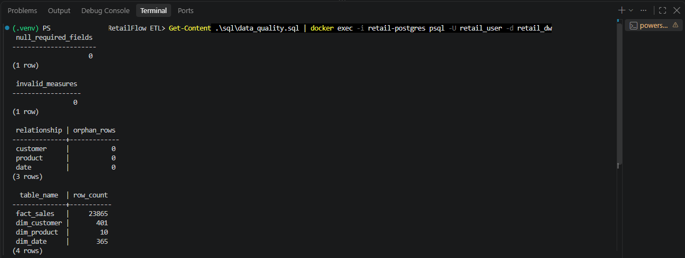
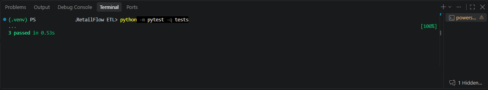

# RetailFlow ETL

A reproducible batch ETL project that generates retail transaction data, validates and transforms it with Python and Pandas, loads a PostgreSQL star schema, and runs analytical and data-quality SQL.

## Technologies and concepts

- Python, Pandas, NumPy, and modular ETL design
- PostgreSQL tables, constraints, indexes, and transactional loading
- Star-schema modeling with fact and dimension tables
- Rejected-row handling and automated data-quality checks
- SQL joins, CTEs, aggregations, `CASE`, CTAS, `LAG`, and `RANK`
- Pytest, Docker Compose, Git, and environment-based configuration

## Pipeline

```text
Generated/CSV transactions
          |
          v
Extract -> Validate and transform -> Rejected CSV
                         |
                         v
              PostgreSQL star schema
                         |
                         v
        Analytics, quality checks, and CTAS mart
```

## Data model

`fact_sales` stores accepted transaction lines with quantity, unit price, and calculated `total_amount`. It references:

- `dim_customer`
- `dim_product`
- `dim_date`

The loader inserts dimensions before facts inside one PostgreSQL transaction. Primary keys, foreign keys, uniqueness constraints, and positive-measure checks enforce the data model; indexes support common fact-table lookups.

## Repository structure

```text
data/raw/                       Generated or supplied input CSV
data/rejected/                  Rejected rows and reasons
evidence/                       Execution screenshots and ETL log
sql/schema.sql                  Star-schema DDL and indexes
sql/analytics.sql               CTE, window-function, CASE, and CTAS queries
sql/data_quality.sql            Null, measure, orphan, and row-count checks
src/extract.py                  Input and required-column validation
src/transform.py                Cleaning, validation, dimensions, and facts
src/load.py                     Transactional PostgreSQL full refresh
src/pipeline.py                 ETL orchestration and logging
src/generate_sample_data.py     Reproducible synthetic-data generator
tests/test_transform.py         Transformation tests
```

## Data-quality rules

A row is rejected when:

- `invoice_no` or `stock_code` is missing
- The invoice date is missing or invalid
- Quantity or unit price is missing or non-positive
- The invoice number begins with uppercase `C`
- The invoice, product, and timestamp combination is duplicated

Rejected rows are written to `data/rejected/rejected_rows.csv` with a `rejection_reason`. Missing customer IDs are retained as `UNKNOWN`; missing descriptions and countries receive explicit fallback values.

## Setup

Prerequisites: Python 3.10+, Docker Desktop, and Docker Compose. Run all commands from the repository root.

### Windows PowerShell

```powershell
python -m venv .venv
Set-ExecutionPolicy -Scope Process -ExecutionPolicy Bypass
.venv\Scripts\Activate.ps1
python -m pip install -r requirements.txt
Copy-Item .env.example .env
docker compose up -d
python -m src.generate_sample_data --rows 25000
python -m src.pipeline
python -m pytest -q tests

Get-Content sql/analytics.sql | docker exec -i retail-postgres psql -v ON_ERROR_STOP=1 -U retail_user -d retail_dw -f -
Get-Content sql/data_quality.sql | docker exec -i retail-postgres psql -v ON_ERROR_STOP=1 -U retail_user -d retail_dw -f -
```

### macOS/Linux

```bash
python3 -m venv .venv
source .venv/bin/activate
python -m pip install -r requirements.txt
cp .env.example .env
docker compose up -d
python -m src.generate_sample_data --rows 25000
python -m src.pipeline
python -m pytest -q tests

docker exec -i retail-postgres psql -v ON_ERROR_STOP=1 -U retail_user -d retail_dw -f - < sql/analytics.sql
docker exec -i retail-postgres psql -v ON_ERROR_STOP=1 -U retail_user -d retail_dw -f - < sql/data_quality.sql
```

The generator creates 25,000 base rows and appends 20 intentional duplicates to test rejection logic, producing 25,020 raw rows. The ETL performs a full refresh of the four star-schema tables. Run `analytics.sql` after each ETL execution to rebuild the CTAS table.

Stop PostgreSQL without deleting its volume:

```bash
docker compose down
```

## SQL demonstrated

- CTEs create monthly revenue, product revenue, customer-value, and order-history datasets.
- `LAG` calculates month-over-month revenue growth and time between customer orders.
- `RANK` identifies the five highest-revenue products per month.
- `CASE` segments customers by lifetime value.
- `CREATE TABLE ... AS SELECT` materializes `mart_monthly_product_sales`.

## Verified results

Verified locally on September 3, 2026:

| Check | Result |
|---|---:|
| Generated input | 25,020 rows |
| Accepted transactions | 23,865 rows |
| Rejected transactions | 1,155 rows |
| Customers | 401 |
| Products | 10 |
| Dates | 365 |
| Monthly product mart | 120 rows |
| Null required fields | 0 |
| Invalid measures | 0 |
| Orphan foreign keys | 0 |
| Automated tests | 3 passed |

The pipeline was executed twice, and `fact_sales` remained at 23,865 rows after the second full refresh.

## Execution evidence

### Successful ETL execution



### PostgreSQL tables



### Monthly revenue



### Top-five products



### Data-quality validation



### Automated tests



The complete run log is available at [evidence/etl_run.txt](evidence/etl_run.txt). Screenshots are supporting evidence; all results can be reproduced using the commands above.

## Limitations

- The included dataset is synthetic, not company or production data.
- The pipeline uses full-refresh loading rather than incremental loading.
- It runs locally without orchestration or cloud deployment.
- Database integration tests and CI are not yet included.